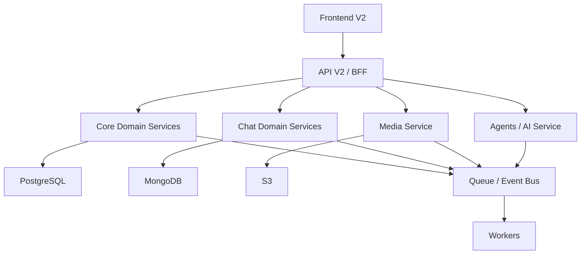

# Shared V2 Context

## Objetivo

Servir como contexto compartilhado entre frontend V2 e API V2.

## Problemas observados no sistema atual

- concentração excessiva de responsabilidades em uma única API;
- acoplamento entre core do produto, chat, WhatsApp, IA e upload;
- banco único armazenando domínios com características muito diferentes;
- processamento de alto volume acontecendo dentro da mesma aplicação que atende login, dashboard e operações administrativas;
- mistura de fluxos síncronos e assíncronos sem fronteiras claras.

## Direção arquitetural aprovada

- `Frontend V2` separado do legado.
- `API V2` separada do backend atual.
- `Core do sistema` isolado do `domínio WhatsApp`.
- `PostgreSQL` como banco principal do core.
- `MongoDB` exclusivo para o domínio de WhatsApp.
- `S3` para arquivos e mídia.
- `Fila + workers` para tarefas pesadas e processamento assíncrono.

## Princípios

1. Separar domínios antes de separar tecnologia.
2. Evitar que o WhatsApp dite o desenho do core do produto.
3. Proteger o core transacional do volume de mensagens.
4. Toda mídia deve ir para `S3`, não para disco local como estratégia principal.
5. Toda operação pesada deve ser elegível para fila.
6. O frontend deve consumir contratos estáveis, não depender de detalhes internos do banco.
7. A V2 não deve herdar o acoplamento do legado.

## Macrodomínios da V2

- `Identity & Access`
- `Users & Profiles`
- `Courses & Lessons`
- `Events & Registrations`
- `CRM & Contacts`
- `Notifications`
- `Media & Uploads`
- `Chat & WhatsApp`
- `Agents & AI`

## Arquitetura alvo

## Decisão de adoção

Para a V2, o melhor caminho não é começar com microserviços independentes desde o primeiro commit.

O melhor caminho é:

1. nascer com `módulos e contratos bem separados`;
2. usar um `API V2` com fronteiras internas fortes;
3. já separar persistência por domínio;
4. introduzir `workers` desde cedo;
5. deixar extração física de serviços como evolução natural.
